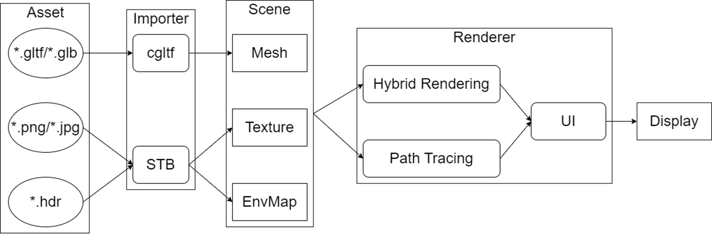

# CSIG
第四届CSIG图像图形技术挑战赛-AMD赛道：光照渲染及渲染优化

## 编译与运行

* 系统要求：Win 10/11
* 编译器：MSVC
* 硬件要求：支持Vulkan光线追踪扩展的显卡，已在RX7900GRE、RTX2060S、RTX3060、RTX4080上进行测试
* Vulkan版本：1.3.261.1

项目使用[xmake](https://xmake.io/#/)进行构建，成功安装xmake后编译项目：

```
xmake -y
```

运行项目：

```shell	
xmake run
```

## 功能简介

- 场景支持：gltf、glb文件
- 材质模型：PBR材质
- 路径追踪管线
  - 光源重要性采样
  - 材质重要性采样
  - 多重重要性采样
- 混合管线
  - GBuffer光栅化绘制，使用Indirect Draw进行优化
  - 直接光照：ReSTIR面光源直接光采样
  - 光线追踪环境光遮蔽
  - 全局光照：DDGI
  - 光线追踪高光反射
  - 后处理：Bloom、Tonemap
  - 抗锯齿：TAA
  - 超采样：FSR

## 框架概述



## 渲染管线概述


## 功能展示

### 路径追踪


### 混合管线


