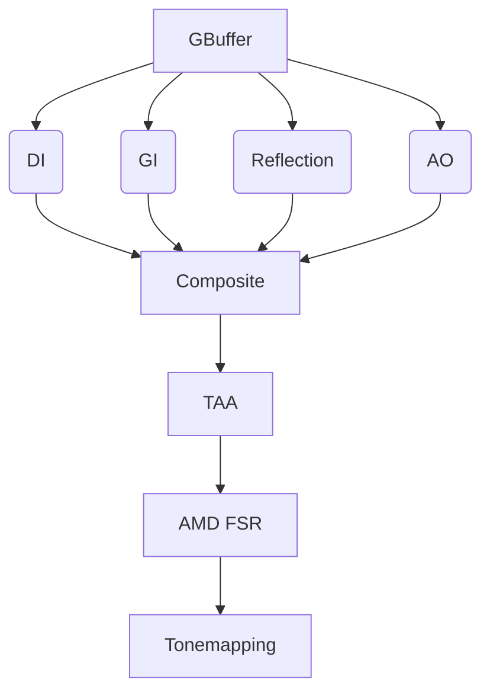
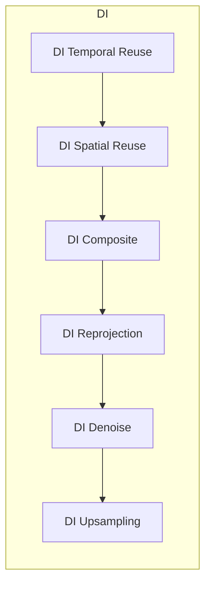
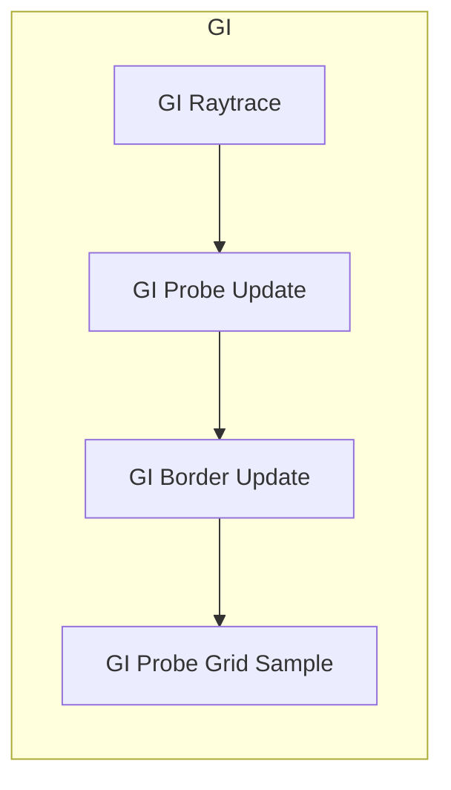
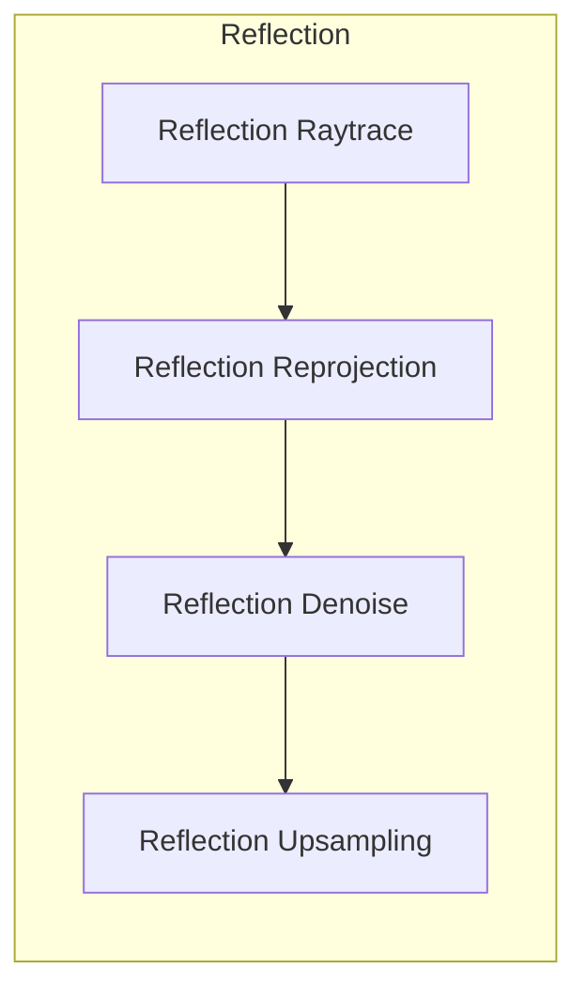
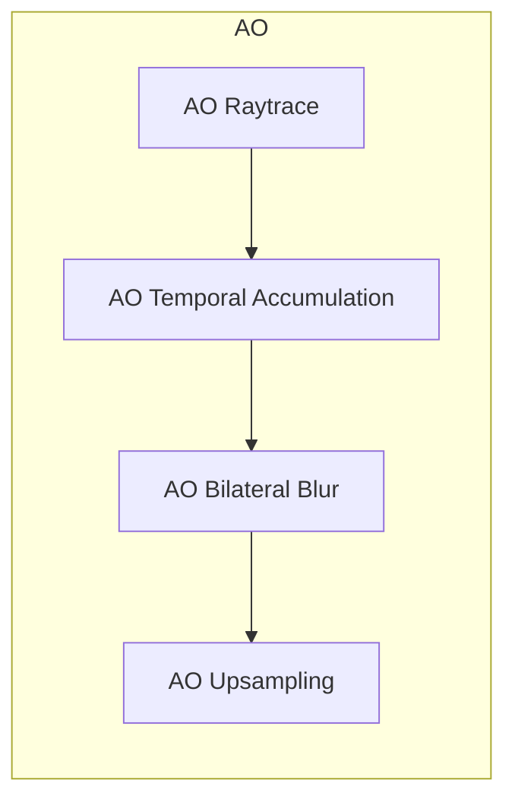

# 技术报告

本渲染器基于 Vulkan 图形 API 进行光栅化与光线追踪求交。

本渲染器拥有两套管线，**混合管线**和**路径追踪管线**。 下面逐一进行说明。

## 混合管线

混合管线的渲染流程如下：

### GBuffer

输出为三张 RGBA 贴图
- GBufferA: `base_color.rgb`, `roughness_metallic.g`
- GBufferB: `normal`, `motion_vector`
- GBufferC: `roughness_metallic.r`, `curvature`, `instance_id`, `linear_z`

其中 normal 采用 octahedral 表示.

### DI (Direct Illumination)

### GI (Global Illumination)

### Reflection

### AO (Ambient Occlusion)

### Composite

### TAA

### FSR

### Tonemapping

