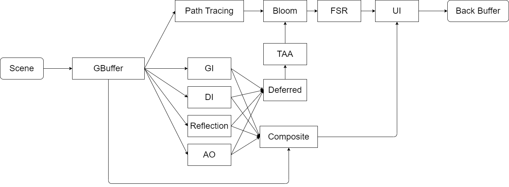

# 技术报告

## 操作方式

* `W`、`A`、`S`、`D`、`Q`、`E`：FPS相机漫游
* 鼠标滑轮：调整相机移动速度
* `G`：显示/隐藏UI
* `H`：截图

## 架构概述

### 渲染管线架构

本项目包含路径追踪离线渲染管线和混合实时渲染管线

* `GBuffer`：生成GBuffer以便于后续渲染流程与屏幕空间后处理操作
* `Path Tracing`：路径追踪算法
* `GI`：光线追踪全局光照算法，本项目采用DDGI Probe based的方案
* `DI`：光线追踪直接光照算法，本项目采用ReSTIR进行加速
* `Reflection`：光线追踪反射算法
* `AO`：光线追踪环境光遮蔽算法
* `Deferred`：延迟着色，融合前面计算结果得到最终的渲染结果
* `TAA`：时间域抗锯齿算法
* `Bloom`：辉光后处理算法
* `FSR`：AMD FidelityFX超采样算法
* `UI`：绘制UI方便调试与交互
* `Composite`：用于输出debug view等操作

## 算法详解与结果展示

### GBuffer

各个通道编码信息如上图所示，由于本项目只需考虑静态场景，因此在渲染时将预计算相应的Indirect Command，并存在GPU的Buffer中，在光栅化时调用Indirect Draw方法进行绘制，以此降低光栅化所需的draw call

### Path Tracing

### GI

### DI

### Reflection

### AO

### Deferred

### TAA

### Bloom

### FSR